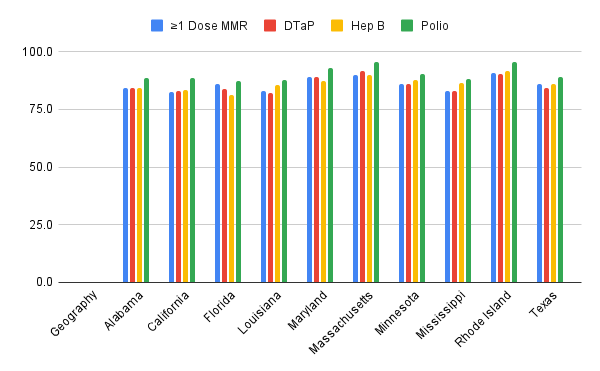
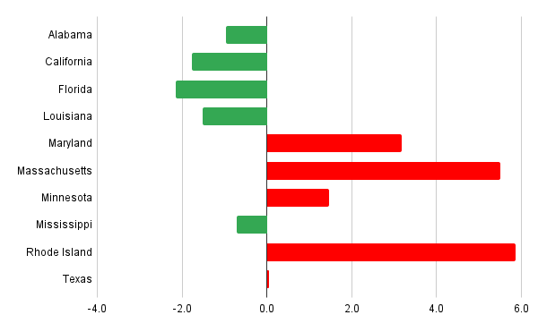

# Significant Differences in Childhood Vaccination Coverage Across U.S.

According to the newest publicly available data from the U.S. Centers for Disease Control and Prevention for children (0 to 35 months) born from 2017 to 2021, childhood vaccination coverage varies widely across different states. To highlight regional differences, 10 states are selected for their coverage rates near the national average as well as those significantly above or below it. Four routine childhood vaccines are examined: measles, mumps, and rubella vaccine (MMR), diphtheria, tetanus, and pertussis vaccine (DTaP), hepatitis B vaccine (Hep B), and polio vaccine.

Bar charts show that states in New England, particularly Rhode Island and Massachusetts, have the highest coverage rates, averaging 92.1 percent and 91.8 percent respectively. These figures are well above the national average of 86.2 percent. In contrast, California, Florida, and Louisiana have average coverage rates around 84 percent, below the national average.

Vaccination coverage also differs by vaccine type. DTaP and polio vaccines generally have higher rates, while hepatitis B and MMR coverage lags in some low-coverage states. For example, Florida has a hepatitis B vaccination rate of just 81.3 percent, roughly 4 percentage points below the national average.

Comparisons with national averages reveal that some states exceed the average by more than five percentage points, while low-coverage states fall one to two points below. Public health experts note that these differences may reflect [placeholder for expert comment].

Overall, high-coverage states show relatively balanced rates across all four vaccines, whereas low-coverage states fall behind more noticeably for certain vaccines. To improve overall childhood immunization rates, public health decision-makers [placeholder for policy recommendation or expert opinion].

-30-
