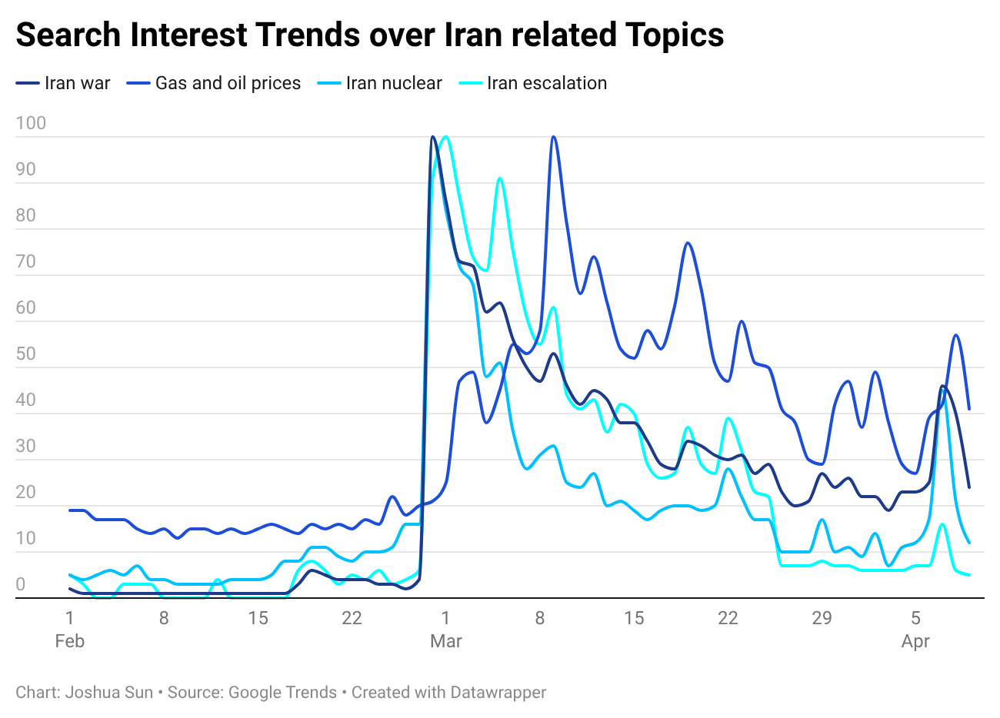

Search data show that in the initial stage after the military strike, the American public paid close attention to the war itself. However, this attention declined quickly. Within a few days, searches related to oil prices rose rapidly and remained higher than searches about the war itself for most of the period during the conflict.

At the same time, searches related to the risk of escalation also increased quickly after the strike, reflecting public concern that the conflict might expand further.

For many Americans, the war initially appeared as a national security event, but it gradually shifted into an economic issue affecting the cost of everyday life.

[Datawrapper](https://www.datawrapper.de/_/3iGpH/)
[Google Sheets](https://docs.google.com/spreadsheets/d/1rVJtV4eLZnw7Yer4AOTtTIpQbxSYndQhDniSHQGUZmQ/edit?usp=sharing)
